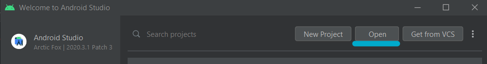

<h1 align="center">
  <a href="https://github.com/dec0dOS/amazing-github-template">
    
  </a>
</h1>

<div align="center">
  <h1>Webinar Material Design 2021</h1>
  <h4>Universidade de Coimbra, FCTUC, Departamento de Engenharia Informática</h4>
  <br />
  <h5>Autores</h5>
  <a href="https://github.com/raquel-f">Raquel Ferreira</a>
  &nbsp;|&nbsp;
  <a href="https://github.com/RFigas">Ricardo Figueiredo</a>
</div>

<br />
<br />
<br />

<details open="open">
<summary>Table of Contents</summary>

- [Português](#pt)
  - [Pré-Requisitos](#Pré-requisitos)
  - [Configuração](#Configuração)
  - [Versões](#versões)
  - [Reconhecimentos](#reconhecimentos)
  - [Informação Autores](#Autores-1)
- [English](#en)
  - [Prerequisites](#prerequisites)
  - [Setup](#setup)
  - [Versions](#versions)
  - [Acknowledgements](#Acknowledgements)
  - [Author Information](#authors)
</details>

---

## PT

### Pré-Requisitos

<table>
<tr>
<td>
Para a realização da parte prática deste Webinar certifica-te que tens os seguintes componentes instalados e disponíveis:

- Java
- Android Studio
- Emulador de Smartphone no Android Studio
- Template do projeto (este repositório)
- Motivação para aprender!
</td>
</tr>
</table>

### Configuração

<br/>
<h4>Template do projeto</h4>

Em primeiro lugar, precisas de ter a template do projeto na tua máquina local. Para tal, podes fazer clone do repositório

```sh
git clone https://github.com/raquel-f/CM-Webinar.git
```

Se não tiveres _git_ na tua máquina não te preocupes: podes sempre fazer o download do projeto em formato zip.

<br/>
<h4>Android Studio</h4>

Depois de teres o projeto na tua máquina, abre o Android Studio e clica em **open** para abrir o projeto.

<a href="https://github.com/dec0dOS/amazing-github-template">
    
  </a>

<br/>
<br/>
<h4>Estás pront@!</h4>
Durante o webinar vamos guiar-te sobre a estrutura do projeto e o que fazer para transformares esta template feia com Material Design.

### Versões
Para evitar que tenhas problemas durante o webinar, deixamos-te aqui as versões que estamos a utilizar

| Nome                        | Versão                      | Download                                                |
| ----------------------------| --------------------        |-----------------                                        |
| Java                        | 1.8                         | [Java](https://www.java.com/download/ie_manual.jsp)     |
| Android Studio              | Arctic Fox 2020.3.1 Patch 3 | [Android Studio](https://developer.android.com/studio)  |
| Android Gradle Plugin       | 7.0.3                       | (incluído no Android Studio)                            |
| Gradle                      | 7.0.2                       | (incluído no Android Studio)                            |

### Reconhecimentos
Agradecemos bastante aos docentes da cadeira Prof. Tiago Cruz e Prof. João Fernandes pela sua grande disponibilidade em nos ajudar com qualquer dúvida que surgiu durante o desenvolvimento deste webinar.
<br />
<br />
Obrigada a todos os participantes do webinar!

### Autores
<table>
<th> Raquel Ferreira</th>
<tr>
<td>

Estudante de Mestrado em Engenharia Informática com especialização em Engenharia de Software. 
<br/>Responsável por:
- Criação da template de projeto
- Gestão do repositório
- Implementação de Material Design
- Segunda parte prática do Webinar
- Publicidade do evento
</td>
</tr>
</table>

<table>
<th> Ricardo Figueiredo</th>
<tr>
<td>

Estudante de Mestrado em Engenharia Informática com especialização em Engenharia de Software. 
<br/>Responsável por:
- Criação da template de projeto
- Implementação de Material Design
- Primeira parte prática do Webinar
</td>
</tr>
</table>

---

## EN

### Prerequisites

<table>
<tr>
<td>
To follow along the practical part of the Webinar, make sure you have the following components installed and readily available:

- Java
- Android Studio
- Smartphone Emulator in Android Studio
- Project Template (this repository)
- Motivation to learn!
</td>
</tr>
</table>

### Setup

<br/>
<h4>Project Template</h4>

First, you need to have the project template in your local machine. To do so, you can clone this repository: 

```sh
git clone https://github.com/raquel-f/CM-Webinar.git
```
If you don't have _git_ in your local machine don't worry: you can always download the project as a zip file.

<br/>
<h4>Android Studio</h4>

After downloading the project, open Android Studio and open the project.

<a href="https://github.com/dec0dOS/amazing-github-template">
    
  </a>

<br/>
<br/>
<h4>That's it!</h4>
During the webinar we'll explain all about the project structure and how you can transform this ugly template with Material Design.


### Versions

To avoid having problems during the webinar, we'll leave you the versions of the software we used during its creation

| Name                        | Version                     | Download                                                |
| ----------------------------| --------------------        |-----------------                                        |
| Java                        | 1.8                         | [Java](https://www.java.com/download/ie_manual.jsp)     |
| Android Studio              | Arctic Fox 2020.3.1 Patch 3 | [Android Studio](https://developer.android.com/studio)  |
| Android Gradle Plugin       | 7.0.3                       | (included in Android Studio)                            |
| Gradle                      | 7.0.2                       | (included in Android Studio)                            |

### Acknowledgements
We would like to show our appreciation to the professors of this class Prof. Tiago Cruz and Prof. João Fernandes for their great availability  to help us with any questions that arose during the development of this webinar.
<br />
<br />
Thanks to all who participated in our webinar!

### Authors

<table>
<th> Raquel Ferreira</th>
<tr>
<td>

Master's of Informatics Engineering with a specialization in Software Engineering. 
<br/>Responsible for:
- Template creation
- Repository management
- Material Design implementation
- Second practical part of the webinar
- Event Advertising
</td>
</tr>
</table>

<table>
<th> Ricardo Figueiredo</th>
<tr>
<td>

Master's of Informatics Engineering with a specialization in Software Engineering. 
<br/>Responsible for:
- Template creation
- Material Design implementation
- First practical part of the webinar
</td>
</tr>
</table>


